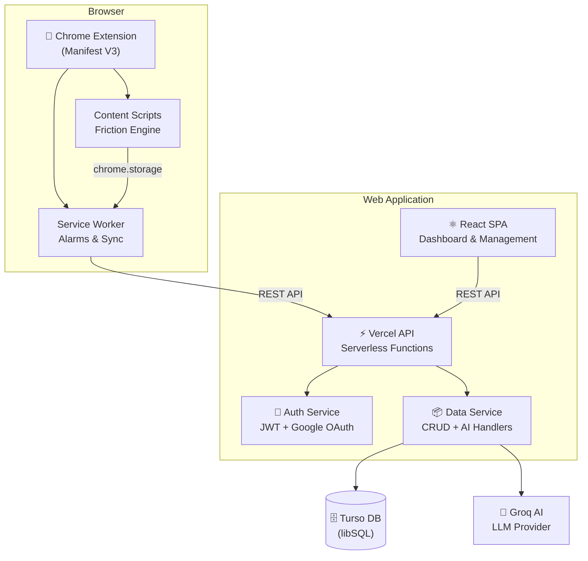

<p align="center">
  
</p>

<h1 align="center">LifeSolver</h1>

<p align="center">
  <strong>Your AI-Powered Personal Operating System</strong>
</p>

<p align="center">
  <a href="https://life-solver.vercel.app">
    
  </a>
  <a href="https://life-solver.vercel.app/downloads/lifesolver-extension.zip">
    
  </a>
  
  
</p>

<p align="center">
  A comprehensive personal management platform designed to streamline your productivity,<br/>
  finances, and habits into a single, intelligent interface — with a supportive browser extension<br/>
  that brings your goals into every tab.
</p>

---

## 📦 Monorepo Structure

This repository is organized as an **npm workspaces** monorepo containing two applications:

```
lifesolver/
├── apps/
│   ├── web/                  # 🌐 Full-stack web application (React + Express)
│   │   ├── frontend/         #    React SPA with shadcn/ui components
│   │   ├── backend/          #    Microservices (auth-service, data-service)
│   │   ├── api/              #    Vercel serverless API routes
│   │   ├── public/downloads/ #    Extension ZIP for direct download
│   │   ├── scripts/          #    Build & migration utilities
│   │   └── package.json
│   │
│   └── extension/            # 🧩 Chrome Extension (Manifest V3)
│       ├── src/
│       │   ├── components/   #    React popup UI (Dashboard, Chat, Detox, Growth)
│       │   ├── content/      #    Content scripts & friction engine modules
│       │   ├── background/   #    Service worker & alarm management
│       │   ├── hooks/        #    Custom React hooks (useAuth, useDetox, etc.)
│       │   └── lib/          #    API client & utilities
│       ├── public/           #    Extension icons & assets
│       ├── scripts/          #    Build, ZIP, and deploy scripts
│       ├── store-assets/     #    Chrome Web Store promotional images
│       ├── manifest.json     #    Chrome Extension manifest (MV3)
│       ├── PUBLISHING.md     #    Chrome Web Store publishing guide
│       └── package.json
│
├── .agent/                   # 🤖 AI agent skills & configuration
├── package.json              # 📋 Root workspace configuration
└── README.md                 # 📖 You are here
```

> **AI Agent Developers:** The extension source lives at `apps/extension/src/`. Key entry points are `App.tsx` (popup), `content/content.ts` (content script), and `background/service-worker.ts` (background). The friction engine modules are in `content/modules/`.

---

## 🌐 Web Application (`apps/web`)

The **"Brain"** — where you define your goals, manage your finances, and set your schedule.

### Core Features

| Feature | Description |
|---|---|
| **📊 AI Dashboard** | Bento-style hub with daily AI briefings, activity pulse, and financial overview |
| **📝 Task Management** | Priority-based tasks with urgency levels, status tracking, and deadlines |
| **🔄 Habit Architecture** | Consistency tracking with streak visualization and analytics |
| **💰 Finance Suite** | Cash flow tracking, monthly budgets, savings goals with category tags |
| **🎓 Study Tracker** | Academic progress management with subjects, chapters, and completion % |
| **🤖 Orbit AI** | Context-aware chat assistant that understands your tasks, habits, and budgets |

### Tech Stack

| Layer | Technology |
|---|---|
| **Frontend** | React 18 · TypeScript · Vite · shadcn/ui · Tailwind CSS 3 · Framer Motion |
| **Backend** | Express 5 · Microservices (Auth + Data) · JWT · Nodemailer |
| **Database** | Turso (libSQL) |
| **Deployment** | Vercel (frontend + serverless) · Docker (backend services) |
| **Mobile** | Capacitor (Android) |

---

## 🧩 Chrome Extension (`apps/extension`)

The **"Enforcer"** — adds psychological friction to distracting sites to keep you focused on the goals you defined in the web app.

### Core Features

| Feature | Description |
|---|---|
| **📊 Focus Dashboard** | Real-time browsing analytics, peak hour tracking, and productivity budgets |
| **🧘 Friction Engine** | Grayscale mode, breathing gates, heavy scroll, cognitive bypass, temporal friction |
| **🛡️ Smart Detox** | OTP-verified focus sessions with deep blocking and anti-quit protocols |
| **🧠 AI Sidekick** | Intelligent chat interface — manage habits and tasks without leaving the tab |
| **📝 Growth Insights** | Reflective journaling prompts and batch-synced friction analytics |
| **🚫 Feed Eradicator** | Hides infinite feeds (Home, Suggested) while keeping search functional |

### Tech Stack

| Layer | Technology |
|---|---|
| **UI** | React 19 · TypeScript · Vite · Tailwind CSS 4 · Framer Motion |
| **Extension** | Manifest V3 · Chrome APIs (storage, tabs, alarms) · CRXJS Vite Plugin |
| **Content Scripts** | Vanilla TS modules for friction injection, feed hiding, detox overlays |

---

## 🚀 Getting Started

### Prerequisites

- **Node.js** ≥ 18.0.0
- **npm** ≥ 9.0.0
- **Git**

### Installation

```bash
# 1. Clone the repository
git clone https://github.com/Nisarr/LifeSolver.git
cd LifeSolver

# 2. Install all workspace dependencies from root
npm install
```

### Development

```bash
# Run the web app (frontend + API server)
npm run dev:web

# Run the extension in dev mode (hot-reload via CRXJS)
npm run dev:extension

# Build everything
npm run build

# Build extension + deploy ZIP to web app's public folder
npm run deploy:extension
```


## 🚀 Deployment

### Web App — Vercel (Live)

The web application is hosted on **Vercel** at **[life-solver.vercel.app](https://life-solver.vercel.app)**.

> **⚠️ Monorepo Note:** After merging this restructure, update the Vercel project settings:
> - **Settings → General → Root Directory** → set to `apps/web`
> - Build command and output directory remain the same (`vite build` → `dist`)

### Backend Services — Docker

The backend microservices are containerized via Docker Compose:

```bash
# From the web app directory
cd apps/web
docker-compose up -d
```

| Service | Port | Description |
|---|---|---|
| **auth-service** | `3001` | Authentication (JWT, Google OAuth, OTP email verification) |
| **data-service** | `3002` | Data CRUD, AI handlers, extension sync endpoints |

### Chrome Extension

#### 🌐 From the Website (Recommended for Users)

Users visiting [life-solver.vercel.app](https://life-solver.vercel.app) on Chrome will see an install banner that:
1. Downloads the extension as a ZIP file
2. Shows a step-by-step installation guide

The guide walks users through:
- Extracting the ZIP
- Opening `chrome://extensions`
- Enabling Developer Mode
- Loading the unpacked extension
- Pinning it to the toolbar

#### 🔧 For Developers

```bash
# Build the extension
npm run build:extension

# Build + deploy ZIP to web app's public/downloads/
npm run deploy:extension

# Build ZIP for Chrome Web Store upload
cd apps/extension && npm run build:store
```

Then load in Chrome: `chrome://extensions` → **Developer mode** → **Load unpacked** → `apps/extension/dist`

#### 🏪 Chrome Web Store (Future)

See [`apps/extension/PUBLISHING.md`](apps/extension/PUBLISHING.md) for the complete Chrome Web Store publishing guide with store listing copy, permission justifications, and asset requirements.

---

## 🏗️ Architecture Overview



---

## 📁 Key Directories Reference

> For AI agents, contributors, and developers navigating this codebase:

| Path | Purpose |
|---|---|
| `apps/web/frontend/web-app/src/` | Web app React components, pages, hooks, and contexts |
| `apps/web/backend/auth-service/` | Authentication microservice (JWT, OAuth, OTP) |
| `apps/web/backend/data-service/` | Data microservice (tasks, habits, budgets, AI) |
| `apps/web/api/` | Vercel serverless API entry points |
| `apps/extension/src/components/` | Extension popup React UI components |
| `apps/extension/src/content/` | Content scripts injected into web pages |
| `apps/extension/src/content/modules/` | Friction engine modules (grayscale, breathing gate, feed hide) |
| `apps/extension/src/background/` | Service worker for alarms, sync, and background tasks |
| `apps/extension/src/hooks/` | Extension-specific React hooks |
| `apps/extension/manifest.json` | Chrome Extension Manifest V3 configuration |
| `apps/extension/scripts/` | Build-store and deploy-extension scripts |
| `apps/extension/PUBLISHING.md` | Chrome Web Store publishing guide |
| `apps/web/public/downloads/` | Extension ZIP served as static download |
| `apps/web/.../PrivacyPolicyPage.tsx` | Privacy policy page (required for store submission) |
| `apps/web/.../ExtensionInstallBanner.tsx` | Smart install banner + step-by-step guide modal |

---

## 🤝 Contributing

1. **Fork** the repository
2. **Create** a feature branch: `git checkout -b feat/my-feature`
3. **Commit** with conventional commits: `git commit -m "feat: add new feature"`
4. **Push** to your fork: `git push origin feat/my-feature`
5. **Open** a Pull Request

### Commit Convention

This project follows [Conventional Commits](https://www.conventionalcommits.org/):

| Prefix | Usage |
|---|---|
| `feat:` | New feature |
| `fix:` | Bug fix |
| `refactor:` | Code restructuring without behavior change |
| `docs:` | Documentation only |
| `chore:` | Build process, CI, or tooling changes |
| `test:` | Adding or updating tests |

---

## 📄 License

This project is licensed under the **MIT License** — see the [LICENSE](LICENSE) file for details.

---

<p align="center">
  <strong>LifeSolver</strong> — Solve your life, one goal at a time.<br/>
  <sub>Built with ❤️ | <a href="https://life-solver.vercel.app/privacy-policy">Privacy Policy</a></sub>
</p>
